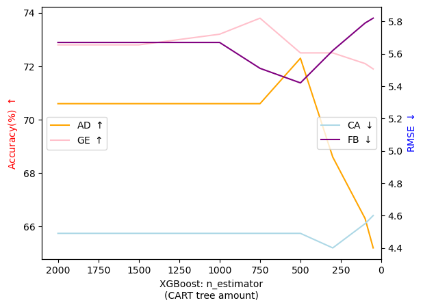

# For KDD24' Anonymous Rebuttal (Submission ID: 1763)

This is a temporary page to present additional experiment results and analysis for anonymous rebuttal.

Currently this page contains extra rebuttal contents of <b>submission 1763 *Team up GBDTs and DNNs: Advancing Efficient and Effective Tabular Prediction with Tree-hybrid MLPs*</b> in KDD 24'. <b>All used reference No. follow the original ones in the paper</b> if without specification.

**Anchors to detailed response materials**:
- [To R twnd](#💬-To-R-twnd)
- [To R pAZD](#💬-To-R-pAZD)

# 💬-To-R-twnd 

## QA3: The average ranks (standard deviations) on different imbalance-level scenarios
<!-- 
<b></b>
 -->

|                          | XGBoost       | CatBoost  | MLP       | AutoInt   | DCNv2     | TabNet    | SAINT     | FT-T      | T-MLP     | T-MLP(3)      |
| :----------------------- | :------------ | :-------- | :-------- | :-------- | :-------- | :-------- | :-------- | :-------- | :-------- | :------------ |
| $p < 0.33$ (32 datasets)  | 5\.0(3.0)     | 4\.8(3.2) | 6\.5(2.6) | 5\.4(2.5) | 5\.1(2.6) | 7\.7(2.8) | 6\.0(2.1) | 5\.0(2.4) | 5\.5(3.2) | **4\.1(2.5)** |
| $p < 0.3$ (18 datasets)   | 5\.2(3.4)     | 4\.6(3.1) | 6\.7(2.6) | 4\.6(2.4) | 5\.3(2.6) | 7\.5(2.7) | 6\.9(2.2) | 4\.9(2.3) | 5\.3(3.3) | **3\.8(2.2)** |
| $p < 0.125$ (12 datasets) | **4\.3(3.2)** | 4\.8(3.1) | 6\.4(3.1) | 4\.6(2.6) | 5\.5(2.7) | 7\.3(2.6) | 7\.3(1.5) | 4\.6(2.1) | 5\.8(3.4) | **4\.3(2.1)** |
| $p < 0.05$ (4 datasets)   | **2\.5(1.0)** | 5\.8(3.3) | 5\.5(3.1) | 3\.5(3.0) | 5\.6(2.2) | 7\.5(3.7) | 7\.6(1.5) | 5\.3(2.5) | 6\.1(2.8) | 4\.8(2.5)     |

**Analysis:** We reuse the recently released work TP-BERTa [2] which was comprehensively evaluated on imbalance-class scenarios with 32 imbalanced binary classification datasets from [OPENTABS Database](https://arxiv.org/pdf/2307.04308.pdf). The $p$ denotes the minor-class proportions, i.e., $p=\frac{\text{min}(P, N)}{D}$ ($P$ is positive sample amount, $N$ is the negative one, and $D$ is the dataset size), indicating the imbalance level of a dataset. It can be clearly seen the ensemble version of T-MLP (T-MLP(3)) still holds its superiority on moderate class-imbalance situations. GBDTs dominates the performance in the extremely imbalanced situations (i.e., $p < 0.05$), but T-MLP(3) still outperforms most DNN baselines. Among DNNs, AutoInt[50] exhibits promising performances in the imbalance-class conditions, which may due to its capability of capturing patterns for minority class by manually combining original features to generate new features.

# 💬-To-R-pAZD

<b>Q1: Constrained novelty since integration techniques from other fields (i.e., GBDT, vision MLPs, langue model pruning)?</b>

A1: Many successful interdisciplinary works stand on the shoulders of existing techniques from other fields

- Vision Transformer (ViT []) incorporated the Transformer architecture to address long-distance pixel interaction in vision tasks.
- TextCNN [] is a textbook-level model using stacked CNN to realize distant word dependency for sentence classification.
- For tabular data field:
    1. FT-T [23] adapted Transformer and BERT-like inference to tabular data learning.
    2. Recently, TabDDPM and TabR integrated diffusion models and k-Nearest-Neighbors algorithm respectively to tabular data prediction

We follow the same paper style. Techniques from other fields are shoulders to push the progress of research community and sharp tools to solve practical problems.

**Reference**
- VIT: An Image is Worth 16x16 Words: Transformers for Image Recognition at Scale, ICLR, 2021.
- TextCNN: Convolutional Neural Networks for Sentence Classification, EMNLP, 2014.
- TabDDPM: TabDDPM: Modelling Tabular Data with Diffusion Models, ICML, 2023.
- TabR: TabR: Tabular Deep Learning Meets Nearest Neighbors, ICLR, 2024.

## QA2: Efficiency on inference time

<b>Inference time overhead against T-MLP on T2G benchmakr</b>

| Dataset | GE       | CH      | EY       | CA       | HO       | AD       | OT       | HE        | JA      | HI       | FB       | YE       | avg      | rank      |
| :---------- | :------- | :------ | :------- | :------- | :------- | :------- | :------- | :-------- | :------ | :------- | :------- | :------- | :------- | :-------- |
| MLP         | x 3\.76  | x 1\.07 | x 0\.61  | x 1\.93  | x 1\.55  | x 3\.61  | x 0\.57  | x 0\.75   | x 0\.35 | x 1\.68  | x 1\.09  | x 1\.20  | x 1\.51  | 8\.3(1.9) |
| SNN         | x 4\.90  | x 0\.91 | x 0\.93  | x 2\.64  | x 1\.13  | x 1\.83  | x 3\.10  | x 0\.30   | x 0\.43 | x 3\.35  | x 2\.95  | x 2\.75  | x 2\.10  | 8\.3(1.5) |
| NODE        | x 49\.49 | x 6\.26 | x 27\.61 | x 88\.72 | x 40\.13 | x 12\.44 | x 24\.17 | x 111\.99 | x 6\.97 | x 54\.30 | x 7\.03  | x 13\.21 | x 36\.86 | 7\.0(3.0) |
| AutoInt     | x 22\.12 | x 2\.44 | x 2\.68  | x 23\.09 | x 4\.82  | x 10\.09 | x 5\.62  | x 0\.67   | x 2\.45 | x 23\.91 | x 3\.20  | x 2\.72  | x 8\.65  | 8\.1(2.0) |
| DCNv2       | x 3\.95  | x 7\.87 | x 0\.38  | x 3\.21  | x 2\.43  | x 5\.10  | x 5\.91  | x 0\.85   | x 0\.15 | x 1\.96  | x 1\.56  | x 1\.16  | x 2\.88  | 8\.3(2.2) |
| FT-T        | x 25\.24 | x 4\.02 | x 2\.87  | x 12\.23 | x 9\.51  | x 8\.43  | x 4\.75  | x 2\.17   | x 1\.53 | x 13\.28 | x 6\.36  | x 15\.25 | x 8\.80  | 4\.7(2.6) |
| T2G         | x 38\.98 | x 5\.34 | x 3\.96  | x 33\.54 | x 10\.33 | x 17\.50 | x 13\.67 | x 3\.71   | x 2\.59 | x 52\.67 | x 12\.32 | x 6\.16  | x 16\.73 | 3\.1(1.7) |
| T-MLP       | x 1\.00  | x 1\.00 | x 1\.00  | x 1\.00  | x 1\.00  | x 1\.00  | x 1\.00  | x 1\.00   | x 1\.00 | x 1\.00  | x 1\.00  | x 1\.00  | x 1\.00  | 3\.3(0.8) |
| T-MLP(3)    | x 1\.18  | x 1\.14 | x 1\.16  | x 1\.15  | x 1\.10  | x 1\.13  | x 1\.19  | x 1\.15   | x 1\.08 | x 1\.20  | x 1\.16  | x 1\.10  | x 1\.15  | 2\.0(1.1) |

**Overall Trend:** T-MLP can achieve SOTA competitive results as T2G-Former on its benchmark with an MLP-level (the first row) inference speed, and its ensemble version with 3 MLPs only takes around 15% more time in average, evidently faster than popular Transformer- or attention-based models (e.g., AutoInt, FT-Transformer, T2G-Former). Moreover, benefited from no hyperparameter tuning, T-MLP holds very controllable and stable inference time (all configs are static), while the searched best model configs of other existing tabular DNNs vary drastically as the random seed changes, especially with the large hyperparameter search space, that is why we repeat 15 random seeds and use the average results.

**In-depth Analysis:** Essentially, for DNN part of T-MLP, the single-block MLP process only contains 4 matrix operations (3 matrix multiplications and 1 Hadamard product), here we omit non-parametric activation functions and normalization for clear analysis.
- **operation 1 & 2:** $H = W_fXW_{h1} + b$, where $X \in \mathbb{R}^{F \times d}$ is the embedded input features of a sample, $W_{h1} \in \mathbb{R}^{d \times 2c}$ is transformation on the hidden dimension, $W_f \in \mathbb{R}^{F \times F}$ is transformation on feature dimension in SGU (Eq. 6), $b$ is the bias term combining the ones of $W_f$ and $W_{h1}$;
- **operation 3 & 4:** $\hat{H} = H_{:, :c} \odot H_{:, c:} W_{h2}$, where $\odot$ is Hadamard product and $W_{h2} \in \mathbb{R}^{c \times d}$ is transformation on hidden dimension, $\hat{H}$ is used for final prediction. 
- **For T-MLP ensemble version**, i.e., T-MLP(3), matrix reduction can be simply realized by contacting respective $W_f$, $W_{h1}$, $W_{h2}$ of 3 MLPs into the larger weight matrices once the weights are frozen (during inference), and the same 4 matrix operations can be performed to calculate 3 MLP processes simultaneously.
- Since we uniformly use a sparsity rate of 0.33 (stated in line 1148), i.e., **around 67% values in the MLP weight matrices are zero**, which are sparse and can get inherent further acceleration by CUDA computation optimization.
- For GBDT part, the trained XGBoost is converted into PyTorch tensor computation by [Microsoft Hummingbird compiling tools](https://github.com/microsoft/hummingbird), and this conversion operation has been done during training, in inference it only needs 3-step matrix multiplications with CUDA acceleration to complete the calculation (detailed mechanism illustration in its repo README).

Contrastively, when considering the Transformer architecture that has been widely adopted in many recent SOTA tabular DNNs, each Transformer block (layer) inevitably contains multi-head self-attention (BERT-like) or masked attention (GPT-like) and FFN modules, and the total matrix multiplication time is evidently more than T-MLP. Moreover, the best model config of Transformer-based DNNs often requires several to tens of blocks (layers). 

Consequently, we can observe around 8~16 times inference speedup when using T-MLP. From the perspective of model simplicity and efficiency, using simple XGboost-MLP architecture to reach comparable or competitive results as the heavily tuned SOTA Transformer-based DNNs and GBDTs on their respective dominating benchmark, all achieved with significantly reduced training & inference time, is our primary focus and contribution, which is aimed at strongly practical & industrial applications and green AI.

## QA3: Expanded ablation datasets & analysis

<table style="border-collapse: collapse; border: none; border-spacing: 0px;">
	<caption>
		<b>The detailed ablation on T2G datasets</d>
	</caption>
	<tr>
		<td style="border-bottom: 1px solid rgb(0, 0, 0); border-top: 1px solid rgb(0, 0, 0); border-right: 1px solid rgb(0, 0, 0); padding-right: 3pt; padding-left: 3pt;">
			T2G Dataset:
		</td>
		<td style="border-bottom: 1px solid rgb(0, 0, 0); border-top: 1px solid rgb(0, 0, 0); border-left: 1px solid rgb(0, 0, 0); padding-right: 3pt; padding-left: 3pt;">
			GE⬆️
		</td>
		<td style="border-bottom: 1px solid rgb(0, 0, 0); border-top: 1px solid rgb(0, 0, 0); padding-right: 3pt; padding-left: 3pt;">
			CH⬆️
		</td>
		<td style="border-bottom: 1px solid rgb(0, 0, 0); border-top: 1px solid rgb(0, 0, 0); padding-right: 3pt; padding-left: 3pt;">
			EY⬆️
		</td>
		<td style="border-bottom: 1px solid rgb(0, 0, 0); border-top: 1px solid rgb(0, 0, 0); padding-right: 3pt; padding-left: 3pt;">
			CA⬇️
		</td>
		<td style="border-bottom: 1px solid rgb(0, 0, 0); border-top: 1px solid rgb(0, 0, 0); padding-right: 3pt; padding-left: 3pt;">
			HO⬇️
		</td>
		<td style="border-bottom: 1px solid rgb(0, 0, 0); border-top: 1px solid rgb(0, 0, 0); padding-right: 3pt; padding-left: 3pt;">
			AD⬆️
		</td>
		<td style="border-bottom: 1px solid rgb(0, 0, 0); border-top: 1px solid rgb(0, 0, 0); padding-right: 3pt; padding-left: 3pt;">
			OT⬆️
		</td>
		<td style="border-bottom: 1px solid rgb(0, 0, 0); border-top: 1px solid rgb(0, 0, 0); padding-right: 3pt; padding-left: 3pt;">
			HE⬆️
		</td>
		<td style="border-bottom: 1px solid rgb(0, 0, 0); border-top: 1px solid rgb(0, 0, 0); padding-right: 3pt; padding-left: 3pt;">
			JA⬆️
		</td>
		<td style="border-bottom: 1px solid rgb(0, 0, 0); border-top: 1px solid rgb(0, 0, 0); padding-right: 3pt; padding-left: 3pt;">
			HI⬆️
		</td>
		<td style="border-bottom: 1px solid rgb(0, 0, 0); border-top: 1px solid rgb(0, 0, 0); padding-right: 3pt; padding-left: 3pt;">
			FB⬇️
		</td>
		<td style="border-bottom: 1px solid rgb(0, 0, 0); border-top: 1px solid rgb(0, 0, 0); padding-right: 3pt; padding-left: 3pt;">
			YE⬇️
		</td>
	</tr>
	<tr>
		<td style="border-top: 1px solid rgb(0, 0, 0); border-right: 1px solid rgb(0, 0, 0); padding-right: 3pt; padding-left: 3pt;">
			T-MLP
		</td>
		<td style="border-top: 1px solid rgb(0, 0, 0); border-left: 1px solid rgb(0, 0, 0); text-align: right; padding-right: 3pt; padding-left: 3pt;">
			<b>0.706</b>
		</td>
		<td style="border-top: 1px solid rgb(0, 0, 0); text-align: right; padding-right: 3pt; padding-left: 3pt;">
			<b>0.862</b>
		</td>
		<td style="border-top: 1px solid rgb(0, 0, 0); text-align: right; padding-right: 3pt; padding-left: 3pt;">
			<b>0.717</b>
		</td>
		<td style="border-top: 1px solid rgb(0, 0, 0); text-align: right; padding-right: 3pt; padding-left: 3pt;">
			<b>0.447</b>
		</td>
		<td style="border-top: 1px solid rgb(0, 0, 0); text-align: right; padding-right: 3pt; padding-left: 3pt;">
			<b>3.125</b>
		</td>
		<td style="border-top: 1px solid rgb(0, 0, 0); text-align: right; padding-right: 3pt; padding-left: 3pt;">
			<b>0.864</b>
		</td>
		<td style="border-top: 1px solid rgb(0, 0, 0); text-align: right; padding-right: 3pt; padding-left: 3pt;">
			<b>0.814</b>
		</td>
		<td style="border-top: 1px solid rgb(0, 0, 0); text-align: right; padding-right: 3pt; padding-left: 3pt;">
			<b>0.386</b>
		</td>
		<td style="border-top: 1px solid rgb(0, 0, 0); text-align: right; padding-right: 3pt; padding-left: 3pt;">
			<b>0.728</b>
		</td>
		<td style="border-top: 1px solid rgb(0, 0, 0); text-align: right; padding-right: 3pt; padding-left: 3pt;">
			<b>0.729</b>
		</td>
		<td style="border-top: 1px solid rgb(0, 0, 0); text-align: right; padding-right: 3pt; padding-left: 3pt;">
			<b>5.667</b>
		</td>
		<td style="border-top: 1px solid rgb(0, 0, 0); text-align: right; padding-right: 3pt; padding-left: 3pt;">
			<b>8.768</b>
		</td>
	</tr>
	<tr>
		<td style="border-right: 1px solid rgb(0, 0, 0); padding-right: 3pt; padding-left: 3pt;">
			w/o sparsity
		</td>
		<td style="border-left: 1px solid rgb(0, 0, 0); text-align: right; padding-right: 3pt; padding-left: 3pt;">
			0.681
		</td>
		<td style="text-align: right; padding-right: 3pt; padding-left: 3pt;">
			0.857
		</td>
		<td style="text-align: right; padding-right: 3pt; padding-left: 3pt;">
			0.688
		</td>
		<td style="text-align: right; padding-right: 3pt; padding-left: 3pt;">
			0.450
		</td>
		<td style="text-align: right; padding-right: 3pt; padding-left: 3pt;">
			3.136
		</td>
		<td style="text-align: right; padding-right: 3pt; padding-left: 3pt;">
			0.857
		</td>
		<td style="text-align: right; padding-right: 3pt; padding-left: 3pt;">
			0.806
		</td>
		<td style="text-align: right; padding-right: 3pt; padding-left: 3pt;">
			0.377
		</td>
		<td style="text-align: right; padding-right: 3pt; padding-left: 3pt;">
			0.720
		</td>
		<td style="text-align: right; padding-right: 3pt; padding-left: 3pt;">
			0.726
		</td>
		<td style="text-align: right; padding-right: 3pt; padding-left: 3pt;">
			5.708
		</td>
		<td style="text-align: right; padding-right: 3pt; padding-left: 3pt;">
			8.887
		</td>
	</tr>
	<tr>
		<td style="border-right: 1px solid rgb(0, 0, 0); padding-right: 3pt; padding-left: 3pt;">
			w/o GBDT FG
		</td>
		<td style="border-left: 1px solid rgb(0, 0, 0); text-align: right; padding-right: 3pt; padding-left: 3pt;">
			0.694
		</td>
		<td style="text-align: right; padding-right: 3pt; padding-left: 3pt;">
			0.858
		</td>
		<td style="text-align: right; padding-right: 3pt; padding-left: 3pt;">
			0.692
		</td>
		<td style="text-align: right; padding-right: 3pt; padding-left: 3pt;">
			0.454
		</td>
		<td style="text-align: right; padding-right: 3pt; padding-left: 3pt;">
			3.172
		</td>
		<td style="text-align: right; padding-right: 3pt; padding-left: 3pt;">
			0.859
		</td>
		<td style="text-align: right; padding-right: 3pt; padding-left: 3pt;">
			0.809
		</td>
		<td style="text-align: right; padding-right: 3pt; padding-left: 3pt;">
			0.372
		</td>
		<td style="text-align: right; padding-right: 3pt; padding-left: 3pt;">
			0.723
		</td>
		<td style="text-align: right; padding-right: 3pt; padding-left: 3pt;">
			0.728
		</td>
		<td style="text-align: right; padding-right: 3pt; padding-left: 3pt;">
			5.736
		</td>
		<td style="text-align: right; padding-right: 3pt; padding-left: 3pt;">
			8.799
		</td>
	</tr>
	<tr>
		<td style="border-right: 1px solid rgb(0, 0, 0); border-bottom: 1px solid rgb(0, 0, 0); padding-right: 3pt; padding-left: 3pt;">
			w/o both
		</td>
		<td style="border-left: 1px solid rgb(0, 0, 0); border-bottom: 1px solid rgb(0, 0, 0); text-align: right; padding-right: 3pt; padding-left: 3pt;">
			0.676
		</td>
		<td style="border-bottom: 1px solid rgb(0, 0, 0); text-align: right; padding-right: 3pt; padding-left: 3pt;">
			0.857
		</td>
		<td style="border-bottom: 1px solid rgb(0, 0, 0); text-align: right; padding-right: 3pt; padding-left: 3pt;">
			0.673
		</td>
		<td style="border-bottom: 1px solid rgb(0, 0, 0); text-align: right; padding-right: 3pt; padding-left: 3pt;">
			0.460
		</td>
		<td style="border-bottom: 1px solid rgb(0, 0, 0); text-align: right; padding-right: 3pt; padding-left: 3pt;">
			3.169
		</td>
		<td style="border-bottom: 1px solid rgb(0, 0, 0); text-align: right; padding-right: 3pt; padding-left: 3pt;">
			0.856
		</td>
		<td style="border-bottom: 1px solid rgb(0, 0, 0); text-align: right; padding-right: 3pt; padding-left: 3pt;">
			0.803
		</td>
		<td style="border-bottom: 1px solid rgb(0, 0, 0); text-align: right; padding-right: 3pt; padding-left: 3pt;">
			0.373
		</td>
		<td style="border-bottom: 1px solid rgb(0, 0, 0); text-align: right; padding-right: 3pt; padding-left: 3pt;">
			0.717
		</td>
		<td style="border-bottom: 1px solid rgb(0, 0, 0); text-align: right; padding-right: 3pt; padding-left: 3pt;">
			0.724
		</td>
		<td style="border-bottom: 1px solid rgb(0, 0, 0); text-align: right; padding-right: 3pt; padding-left: 3pt;">
			5.759
		</td>
		<td style="border-bottom: 1px solid rgb(0, 0, 0); text-align: right; padding-right: 3pt; padding-left: 3pt;">
			8.896
		</td>
	</tr>
	<tr>
		<td style="border-right: 1px solid rgb(0, 0, 0); border-top: 1px solid rgb(0, 0, 0); padding-right: 3pt; padding-left: 3pt;">
			T-MLP (Neural FG)
		</td>
		<td style="border-left: 1px solid rgb(0, 0, 0); border-top: 1px solid rgb(0, 0, 0); text-align: right; padding-right: 3pt; padding-left: 3pt;">
			0.665
		</td>
		<td style="border-top: 1px solid rgb(0, 0, 0); text-align: right; padding-right: 3pt; padding-left: 3pt;">
			0.858
		</td>
		<td style="border-top: 1px solid rgb(0, 0, 0); text-align: right; padding-right: 3pt; padding-left: 3pt;">
			0.699
		</td>
		<td style="border-top: 1px solid rgb(0, 0, 0); text-align: right; padding-right: 3pt; padding-left: 3pt;">
			0.456
		</td>
		<td style="border-top: 1px solid rgb(0, 0, 0); text-align: right; padding-right: 3pt; padding-left: 3pt;">
			3.188
		</td>
		<td style="border-top: 1px solid rgb(0, 0, 0); text-align: right; padding-right: 3pt; padding-left: 3pt;">
			0.852
		</td>
		<td style="border-top: 1px solid rgb(0, 0, 0); text-align: right; padding-right: 3pt; padding-left: 3pt;">
			0.809
		</td>
		<td style="border-top: 1px solid rgb(0, 0, 0); text-align: right; padding-right: 3pt; padding-left: 3pt;">
			0.375
		</td>
		<td style="border-top: 1px solid rgb(0, 0, 0); text-align: right; padding-right: 3pt; padding-left: 3pt;">
			0.721
		</td>
		<td style="border-top: 1px solid rgb(0, 0, 0); text-align: right; padding-right: 3pt; padding-left: 3pt;">
			0.718
		</td>
		<td style="border-top: 1px solid rgb(0, 0, 0); text-align: right; padding-right: 3pt; padding-left: 3pt;">
			5.861
		</td>
		<td style="border-top: 1px solid rgb(0, 0, 0); text-align: right; padding-right: 3pt; padding-left: 3pt;">
			8.925
		</td>
	</tr>
	<tr>
		<td style="border-right: 1px solid rgb(0, 0, 0); border-bottom: 1px solid rgb(0, 0, 0); padding-right: 3pt; padding-left: 3pt;">
			w/o sparsity
		</td>
		<td style="border-left: 1px solid rgb(0, 0, 0); border-bottom: 1px solid rgb(0, 0, 0); text-align: right; padding-right: 3pt; padding-left: 3pt;">
			0.647
		</td>
		<td style="border-bottom: 1px solid rgb(0, 0, 0); text-align: right; padding-right: 3pt; padding-left: 3pt;">
			0.855
		</td>
		<td style="border-bottom: 1px solid rgb(0, 0, 0); text-align: right; padding-right: 3pt; padding-left: 3pt;">
			0.675
		</td>
		<td style="border-bottom: 1px solid rgb(0, 0, 0); text-align: right; padding-right: 3pt; padding-left: 3pt;">
			0.456
		</td>
		<td style="border-bottom: 1px solid rgb(0, 0, 0); text-align: right; padding-right: 3pt; padding-left: 3pt;">
			3.205
		</td>
		<td style="border-bottom: 1px solid rgb(0, 0, 0); text-align: right; padding-right: 3pt; padding-left: 3pt;">
			0.840
		</td>
		<td style="border-bottom: 1px solid rgb(0, 0, 0); text-align: right; padding-right: 3pt; padding-left: 3pt;">
			0.804
		</td>
		<td style="border-bottom: 1px solid rgb(0, 0, 0); text-align: right; padding-right: 3pt; padding-left: 3pt;">
			0.372
		</td>
		<td style="border-bottom: 1px solid rgb(0, 0, 0); text-align: right; padding-right: 3pt; padding-left: 3pt;">
			0.716
		</td>
		<td style="border-bottom: 1px solid rgb(0, 0, 0); text-align: right; padding-right: 3pt; padding-left: 3pt;">
			0.713
		</td>
		<td style="border-bottom: 1px solid rgb(0, 0, 0); text-align: right; padding-right: 3pt; padding-left: 3pt;">
			5.887
		</td>
		<td style="border-bottom: 1px solid rgb(0, 0, 0); text-align: right; padding-right: 3pt; padding-left: 3pt;">
			8.936
		</td>
	</tr>
</table>

**[Analysis]** There are several overall and subtle observations: 
- Both the sparse MLP structure and the GBDT feature gate are improvement points for T-MLP; 
- MLP sparsity often has a more profound impact than the GBDT feature gate on classification tasks, which may be explained by the underlying consistency between model sparsity and the discrete target nature of classification; 
- The GBDT feature gate plays a more important role in regression since it has the capability of selecting salient features to alleviate the impact of noisy features, which may affect precise regression prediction; 
- Our GBDT feature gate is often a better choice than the previously proposed neural feature gate (Neural FG, proposed for biomedical scenario) [] on general tabular data prediction.

Similar trend is observed additionally conducted ablations on FT-Transformer (11 datasets) and SAINT (26 datasets) benchmarks, and we will include all detailed ablation results and analysis in the final version, thank you!

## Q5: How are the fixed hyperparameters initially determined? Fig. 2 exhibits different datasets prefer different sparsity level, are the two fine-grained variables, $z_h$ and $z_{in}$ (line 425-426), for sparsity fixed?

A5: (1) Please refer to QA1 of R hswh on how we determine the hyperparameter values, the default ones are listed in the page bottom. (2) We would like to briefly clarity the **fundamental misunderstandings** here. The introduced $z_h$ and $z_{in}$ are learnable binary masks for masking the corresponding values on MLP weight matrices, which sizes are adaptively determined by the sizes of weight matrices. The true & only hyperparameter in sparsification operation is the target sparsity rate, once it is assigned, the method will promise to produce the two variables with the assigned sparsity rate (target ratio of non-zero values) using CoFi pruning [62]. Secondly, as you said (also shown in Fig. 2), datasets vary in appetite of sparsity rates, we provide win statistics of different sparsity rates on T2G benchmark:

<b>Win statistics of different T-MLP sparsity rates on 12 T2G datasets</b>

| Sparsity rate | 10% | 33% | 50% | 66% | 90% | 100% |
| :------------ | :--: | :--: | :--: | :--: | :--: | :--: |
| Wins          | 0   | 4   | 5   | 2   | 0   | 1    |

Sparsity rate here means how many weights remaining after pruning. The above results show sparsity in T-MLP in often an improvement point, while excessive sparsity can also hurt performance. Therefore, to hold the strength of no hyperparameter tuning and lightweight storage, we keep a fixed sparsity rate of 33% for all datasets (line 449-450) considering both effectiveness and parameter compactness.

# 💬 To R F2J2
- *2021.10* Lorem ipsum dolor sit amet, consectetur adipiscing elit. Vivamus ornare aliquet ipsum, ac tempus justo dapibus sit amet. 
- *2021.09* Lorem ipsum dolor sit amet, consectetur adipiscing elit. Vivamus ornare aliquet ipsum, ac tempus justo dapibus sit amet. 

# 💬 To R jHCg
- *2019.06 - 2022.04 (now)*, Lorem ipsum dolor sit amet, consectetur adipiscing elit. Vivamus ornare aliquet ipsum, ac tempus justo dapibus sit amet. 
- *2015.09 - 2019.06*, Lorem ipsum dolor sit amet, consectetur adipiscing elit. Vivamus ornare aliquet ipsum, ac tempus justo dapibus sit amet. 

# 💬 To R LYyH 

## QA2: Efficiency comparison with GBDT models?
<table style="border-collapse: collapse; border: none; border-spacing: 0px;">
	<caption>
		<b>The overhead of XGBoost training duration against T-MLP</b>
	</caption>
	<tr>
		<td style="border-top: 1px solid rgb(0, 0, 0); border-bottom: 1px solid rgb(0, 0, 0); border-right: 1px solid rgb(0, 0, 0); padding-right: 3pt; padding-left: 3pt;">
		</td>
		<td style="border-top: 1px solid rgb(0, 0, 0); border-bottom: 1px solid rgb(0, 0, 0); border-left: 1px solid rgb(0, 0, 0); padding-right: 3pt; padding-left: 3pt;">
			GE
		</td>
		<td style="border-top: 1px solid rgb(0, 0, 0); border-bottom: 1px solid rgb(0, 0, 0); padding-right: 3pt; padding-left: 3pt;">
			CH
		</td>
		<td style="border-top: 1px solid rgb(0, 0, 0); border-bottom: 1px solid rgb(0, 0, 0); padding-right: 3pt; padding-left: 3pt;">
			EY
		</td>
		<td style="border-top: 1px solid rgb(0, 0, 0); border-bottom: 1px solid rgb(0, 0, 0); padding-right: 3pt; padding-left: 3pt;">
			CA
		</td>
		<td style="border-top: 1px solid rgb(0, 0, 0); border-bottom: 1px solid rgb(0, 0, 0); padding-right: 3pt; padding-left: 3pt;">
			HO
		</td>
		<td style="border-top: 1px solid rgb(0, 0, 0); border-bottom: 1px solid rgb(0, 0, 0); padding-right: 3pt; padding-left: 3pt;">
			AD
		</td>
		<td style="border-top: 1px solid rgb(0, 0, 0); border-bottom: 1px solid rgb(0, 0, 0); padding-right: 3pt; padding-left: 3pt;">
			OT
		</td>
		<td style="border-top: 1px solid rgb(0, 0, 0); border-bottom: 1px solid rgb(0, 0, 0); padding-right: 3pt; padding-left: 3pt;">
			HE
		</td>
		<td style="border-top: 1px solid rgb(0, 0, 0); border-bottom: 1px solid rgb(0, 0, 0); padding-right: 3pt; padding-left: 3pt;">
			JA
		</td>
		<td style="border-top: 1px solid rgb(0, 0, 0); border-bottom: 1px solid rgb(0, 0, 0); padding-right: 3pt; padding-left: 3pt;">
			HI
		</td>
		<td style="border-top: 1px solid rgb(0, 0, 0); border-bottom: 1px solid rgb(0, 0, 0); padding-right: 3pt; padding-left: 3pt;">
			FB
		</td>
		<td style="border-top: 1px solid rgb(0, 0, 0); border-bottom: 1px solid rgb(0, 0, 0); padding-right: 3pt; padding-left: 3pt;">
			YE
		</td>
		<td style="border-top: 1px solid rgb(0, 0, 0); border-bottom: 1px solid rgb(0, 0, 0); padding-right: 3pt; padding-left: 3pt;">
			avg
		</td>
	</tr>
	<tr>
		<td style="border-top: 1px solid rgb(0, 0, 0); border-bottom: 1px solid rgb(0, 0, 0); border-right: 1px solid rgb(0, 0, 0); padding-right: 3pt; padding-left: 3pt;">
			XGBoost(T)
		</td>
		<td style="border-top: 1px solid rgb(0, 0, 0); border-bottom: 1px solid rgb(0, 0, 0); border-left: 1px solid rgb(0, 0, 0); text-align: right; padding-right: 3pt; padding-left: 3pt;">
			x14.72
		</td>
		<td style="border-top: 1px solid rgb(0, 0, 0); border-bottom: 1px solid rgb(0, 0, 0); text-align: right; padding-right: 3pt; padding-left: 3pt;">
			x8.32
		</td>
		<td style="border-top: 1px solid rgb(0, 0, 0); border-bottom: 1px solid rgb(0, 0, 0); text-align: right; padding-right: 3pt; padding-left: 3pt;">
			x14.05
		</td>
		<td style="border-top: 1px solid rgb(0, 0, 0); border-bottom: 1px solid rgb(0, 0, 0); text-align: right; padding-right: 3pt; padding-left: 3pt;">
			x3.87
		</td>
		<td style="border-top: 1px solid rgb(0, 0, 0); border-bottom: 1px solid rgb(0, 0, 0); text-align: right; padding-right: 3pt; padding-left: 3pt;">
			x2.75
		</td>
		<td style="border-top: 1px solid rgb(0, 0, 0); border-bottom: 1px solid rgb(0, 0, 0); text-align: right; padding-right: 3pt; padding-left: 3pt;">
			x6.13
		</td>
		<td style="border-top: 1px solid rgb(0, 0, 0); border-bottom: 1px solid rgb(0, 0, 0); text-align: right; padding-right: 3pt; padding-left: 3pt;">
			x29.89
		</td>
		<td style="border-top: 1px solid rgb(0, 0, 0); border-bottom: 1px solid rgb(0, 0, 0); text-align: right; padding-right: 3pt; padding-left: 3pt;">
			x273.80
		</td>
		<td style="border-top: 1px solid rgb(0, 0, 0); border-bottom: 1px solid rgb(0, 0, 0); text-align: right; padding-right: 3pt; padding-left: 3pt;">
			x71.17
		</td>
		<td style="border-top: 1px solid rgb(0, 0, 0); border-bottom: 1px solid rgb(0, 0, 0); text-align: right; padding-right: 3pt; padding-left: 3pt;">
			x24.13
		</td>
		<td style="border-top: 1px solid rgb(0, 0, 0); border-bottom: 1px solid rgb(0, 0, 0); text-align: right; padding-right: 3pt; padding-left: 3pt;">
			x32.85
		</td>
		<td style="border-top: 1px solid rgb(0, 0, 0); border-bottom: 1px solid rgb(0, 0, 0); text-align: right; padding-right: 3pt; padding-left: 3pt;">
			x25.42
		</td>
		<td style="border-top: 1px solid rgb(0, 0, 0); border-bottom: 1px solid rgb(0, 0, 0); text-align: right; padding-right: 3pt; padding-left: 3pt;">
			x42.26
		</td>
	</tr>
	<tr>
		<td style="border-top: 1px solid rgb(0, 0, 0); border-bottom: 1px solid rgb(0, 0, 0); border-right: 1px solid rgb(0, 0, 0); padding-right: 3pt; padding-left: 3pt;">
			XGBoost(T*)
		</td>
		<td style="border-top: 1px solid rgb(0, 0, 0); border-bottom: 1px solid rgb(0, 0, 0); border-left: 1px solid rgb(0, 0, 0); text-align: right; padding-right: 3pt; padding-left: 3pt;">
			x12.93
		</td>
		<td style="border-top: 1px solid rgb(0, 0, 0); border-bottom: 1px solid rgb(0, 0, 0); text-align: right; padding-right: 3pt; padding-left: 3pt;">
			x11.04
		</td>
		<td style="border-top: 1px solid rgb(0, 0, 0); border-bottom: 1px solid rgb(0, 0, 0); text-align: right; padding-right: 3pt; padding-left: 3pt;">
			x11.21
		</td>
		<td style="border-top: 1px solid rgb(0, 0, 0); border-bottom: 1px solid rgb(0, 0, 0); text-align: right; padding-right: 3pt; padding-left: 3pt;">
			x2.57
		</td>
		<td style="border-top: 1px solid rgb(0, 0, 0); border-bottom: 1px solid rgb(0, 0, 0); text-align: right; padding-right: 3pt; padding-left: 3pt;">
			x2.99
		</td>
		<td style="border-top: 1px solid rgb(0, 0, 0); border-bottom: 1px solid rgb(0, 0, 0); text-align: right; padding-right: 3pt; padding-left: 3pt;">
			x7.39
		</td>
		<td style="border-top: 1px solid rgb(0, 0, 0); border-bottom: 1px solid rgb(0, 0, 0); text-align: right; padding-right: 3pt; padding-left: 3pt;">
			x8.65
		</td>
		<td style="border-top: 1px solid rgb(0, 0, 0); border-bottom: 1px solid rgb(0, 0, 0); text-align: right; padding-right: 3pt; padding-left: 3pt;">
			x425.65
		</td>
		<td style="border-top: 1px solid rgb(0, 0, 0); border-bottom: 1px solid rgb(0, 0, 0); text-align: right; padding-right: 3pt; padding-left: 3pt;">
			x24.35
		</td>
		<td style="border-top: 1px solid rgb(0, 0, 0); border-bottom: 1px solid rgb(0, 0, 0); text-align: right; padding-right: 3pt; padding-left: 3pt;">
			x4.46
		</td>
		<td style="border-top: 1px solid rgb(0, 0, 0); border-bottom: 1px solid rgb(0, 0, 0); text-align: right; padding-right: 3pt; padding-left: 3pt;">
			x22.67
		</td>
		<td style="border-top: 1px solid rgb(0, 0, 0); border-bottom: 1px solid rgb(0, 0, 0); text-align: right; padding-right: 3pt; padding-left: 3pt;">
			x17.69
		</td>
		<td style="border-top: 1px solid rgb(0, 0, 0); border-bottom: 1px solid rgb(0, 0, 0); text-align: right; padding-right: 3pt; padding-left: 3pt;">
			x45.97
		</td>
	</tr>
</table>

## QA3: The GBDT feature gate has the minimal impact?
<table style="border-collapse: collapse; border: none; border-spacing: 0px;">
	<caption>
		<b>QA3: The detailed ablation on T2G datasets</d>
	</caption>
	<tr>
		<td style="border-bottom: 1px solid rgb(0, 0, 0); border-top: 1px solid rgb(0, 0, 0); border-right: 1px solid rgb(0, 0, 0); padding-right: 3pt; padding-left: 3pt;">
			T2G Dataset:
		</td>
		<td style="border-bottom: 1px solid rgb(0, 0, 0); border-top: 1px solid rgb(0, 0, 0); border-left: 1px solid rgb(0, 0, 0); padding-right: 3pt; padding-left: 3pt;">
			GE⬆️
		</td>
		<td style="border-bottom: 1px solid rgb(0, 0, 0); border-top: 1px solid rgb(0, 0, 0); padding-right: 3pt; padding-left: 3pt;">
			CH⬆️
		</td>
		<td style="border-bottom: 1px solid rgb(0, 0, 0); border-top: 1px solid rgb(0, 0, 0); padding-right: 3pt; padding-left: 3pt;">
			EY⬆️
		</td>
		<td style="border-bottom: 1px solid rgb(0, 0, 0); border-top: 1px solid rgb(0, 0, 0); padding-right: 3pt; padding-left: 3pt;">
			CA⬇️
		</td>
		<td style="border-bottom: 1px solid rgb(0, 0, 0); border-top: 1px solid rgb(0, 0, 0); padding-right: 3pt; padding-left: 3pt;">
			HO⬇️
		</td>
		<td style="border-bottom: 1px solid rgb(0, 0, 0); border-top: 1px solid rgb(0, 0, 0); padding-right: 3pt; padding-left: 3pt;">
			AD⬆️
		</td>
		<td style="border-bottom: 1px solid rgb(0, 0, 0); border-top: 1px solid rgb(0, 0, 0); padding-right: 3pt; padding-left: 3pt;">
			OT⬆️
		</td>
		<td style="border-bottom: 1px solid rgb(0, 0, 0); border-top: 1px solid rgb(0, 0, 0); padding-right: 3pt; padding-left: 3pt;">
			HE⬆️
		</td>
		<td style="border-bottom: 1px solid rgb(0, 0, 0); border-top: 1px solid rgb(0, 0, 0); padding-right: 3pt; padding-left: 3pt;">
			JA⬆️
		</td>
		<td style="border-bottom: 1px solid rgb(0, 0, 0); border-top: 1px solid rgb(0, 0, 0); padding-right: 3pt; padding-left: 3pt;">
			HI⬆️
		</td>
		<td style="border-bottom: 1px solid rgb(0, 0, 0); border-top: 1px solid rgb(0, 0, 0); padding-right: 3pt; padding-left: 3pt;">
			FB⬇️
		</td>
		<td style="border-bottom: 1px solid rgb(0, 0, 0); border-top: 1px solid rgb(0, 0, 0); padding-right: 3pt; padding-left: 3pt;">
			YE⬇️
		</td>
	</tr>
	<tr>
		<td style="border-top: 1px solid rgb(0, 0, 0); border-right: 1px solid rgb(0, 0, 0); padding-right: 3pt; padding-left: 3pt;">
			T-MLP
		</td>
		<td style="border-top: 1px solid rgb(0, 0, 0); border-left: 1px solid rgb(0, 0, 0); text-align: right; padding-right: 3pt; padding-left: 3pt;">
			<b>0.706</b>
		</td>
		<td style="border-top: 1px solid rgb(0, 0, 0); text-align: right; padding-right: 3pt; padding-left: 3pt;">
			<b>0.862</b>
		</td>
		<td style="border-top: 1px solid rgb(0, 0, 0); text-align: right; padding-right: 3pt; padding-left: 3pt;">
			<b>0.717</b>
		</td>
		<td style="border-top: 1px solid rgb(0, 0, 0); text-align: right; padding-right: 3pt; padding-left: 3pt;">
			<b>0.447</b>
		</td>
		<td style="border-top: 1px solid rgb(0, 0, 0); text-align: right; padding-right: 3pt; padding-left: 3pt;">
			<b>3.125</b>
		</td>
		<td style="border-top: 1px solid rgb(0, 0, 0); text-align: right; padding-right: 3pt; padding-left: 3pt;">
			<b>0.864</b>
		</td>
		<td style="border-top: 1px solid rgb(0, 0, 0); text-align: right; padding-right: 3pt; padding-left: 3pt;">
			<b>0.814</b>
		</td>
		<td style="border-top: 1px solid rgb(0, 0, 0); text-align: right; padding-right: 3pt; padding-left: 3pt;">
			<b>0.386</b>
		</td>
		<td style="border-top: 1px solid rgb(0, 0, 0); text-align: right; padding-right: 3pt; padding-left: 3pt;">
			<b>0.728</b>
		</td>
		<td style="border-top: 1px solid rgb(0, 0, 0); text-align: right; padding-right: 3pt; padding-left: 3pt;">
			<b>0.729</b>
		</td>
		<td style="border-top: 1px solid rgb(0, 0, 0); text-align: right; padding-right: 3pt; padding-left: 3pt;">
			<b>5.667</b>
		</td>
		<td style="border-top: 1px solid rgb(0, 0, 0); text-align: right; padding-right: 3pt; padding-left: 3pt;">
			<b>8.768</b>
		</td>
	</tr>
	<tr>
		<td style="border-right: 1px solid rgb(0, 0, 0); padding-right: 3pt; padding-left: 3pt;">
			w/o sparsity
		</td>
		<td style="border-left: 1px solid rgb(0, 0, 0); text-align: right; padding-right: 3pt; padding-left: 3pt;">
			0.681
		</td>
		<td style="text-align: right; padding-right: 3pt; padding-left: 3pt;">
			0.857
		</td>
		<td style="text-align: right; padding-right: 3pt; padding-left: 3pt;">
			0.688
		</td>
		<td style="text-align: right; padding-right: 3pt; padding-left: 3pt;">
			0.450
		</td>
		<td style="text-align: right; padding-right: 3pt; padding-left: 3pt;">
			3.136
		</td>
		<td style="text-align: right; padding-right: 3pt; padding-left: 3pt;">
			0.857
		</td>
		<td style="text-align: right; padding-right: 3pt; padding-left: 3pt;">
			0.806
		</td>
		<td style="text-align: right; padding-right: 3pt; padding-left: 3pt;">
			0.377
		</td>
		<td style="text-align: right; padding-right: 3pt; padding-left: 3pt;">
			0.720
		</td>
		<td style="text-align: right; padding-right: 3pt; padding-left: 3pt;">
			0.726
		</td>
		<td style="text-align: right; padding-right: 3pt; padding-left: 3pt;">
			5.708
		</td>
		<td style="text-align: right; padding-right: 3pt; padding-left: 3pt;">
			8.887
		</td>
	</tr>
	<tr>
		<td style="border-right: 1px solid rgb(0, 0, 0); padding-right: 3pt; padding-left: 3pt;">
			w/o GBDT FG
		</td>
		<td style="border-left: 1px solid rgb(0, 0, 0); text-align: right; padding-right: 3pt; padding-left: 3pt;">
			0.694
		</td>
		<td style="text-align: right; padding-right: 3pt; padding-left: 3pt;">
			0.858
		</td>
		<td style="text-align: right; padding-right: 3pt; padding-left: 3pt;">
			0.692
		</td>
		<td style="text-align: right; padding-right: 3pt; padding-left: 3pt;">
			0.454
		</td>
		<td style="text-align: right; padding-right: 3pt; padding-left: 3pt;">
			3.172
		</td>
		<td style="text-align: right; padding-right: 3pt; padding-left: 3pt;">
			0.859
		</td>
		<td style="text-align: right; padding-right: 3pt; padding-left: 3pt;">
			0.809
		</td>
		<td style="text-align: right; padding-right: 3pt; padding-left: 3pt;">
			0.372
		</td>
		<td style="text-align: right; padding-right: 3pt; padding-left: 3pt;">
			0.723
		</td>
		<td style="text-align: right; padding-right: 3pt; padding-left: 3pt;">
			0.728
		</td>
		<td style="text-align: right; padding-right: 3pt; padding-left: 3pt;">
			5.736
		</td>
		<td style="text-align: right; padding-right: 3pt; padding-left: 3pt;">
			8.799
		</td>
	</tr>
	<tr>
		<td style="border-right: 1px solid rgb(0, 0, 0); border-bottom: 1px solid rgb(0, 0, 0); padding-right: 3pt; padding-left: 3pt;">
			w/o both
		</td>
		<td style="border-left: 1px solid rgb(0, 0, 0); border-bottom: 1px solid rgb(0, 0, 0); text-align: right; padding-right: 3pt; padding-left: 3pt;">
			0.676
		</td>
		<td style="border-bottom: 1px solid rgb(0, 0, 0); text-align: right; padding-right: 3pt; padding-left: 3pt;">
			0.857
		</td>
		<td style="border-bottom: 1px solid rgb(0, 0, 0); text-align: right; padding-right: 3pt; padding-left: 3pt;">
			0.673
		</td>
		<td style="border-bottom: 1px solid rgb(0, 0, 0); text-align: right; padding-right: 3pt; padding-left: 3pt;">
			0.460
		</td>
		<td style="border-bottom: 1px solid rgb(0, 0, 0); text-align: right; padding-right: 3pt; padding-left: 3pt;">
			3.169
		</td>
		<td style="border-bottom: 1px solid rgb(0, 0, 0); text-align: right; padding-right: 3pt; padding-left: 3pt;">
			0.856
		</td>
		<td style="border-bottom: 1px solid rgb(0, 0, 0); text-align: right; padding-right: 3pt; padding-left: 3pt;">
			0.803
		</td>
		<td style="border-bottom: 1px solid rgb(0, 0, 0); text-align: right; padding-right: 3pt; padding-left: 3pt;">
			0.373
		</td>
		<td style="border-bottom: 1px solid rgb(0, 0, 0); text-align: right; padding-right: 3pt; padding-left: 3pt;">
			0.717
		</td>
		<td style="border-bottom: 1px solid rgb(0, 0, 0); text-align: right; padding-right: 3pt; padding-left: 3pt;">
			0.724
		</td>
		<td style="border-bottom: 1px solid rgb(0, 0, 0); text-align: right; padding-right: 3pt; padding-left: 3pt;">
			5.759
		</td>
		<td style="border-bottom: 1px solid rgb(0, 0, 0); text-align: right; padding-right: 3pt; padding-left: 3pt;">
			8.896
		</td>
	</tr>
	<tr>
		<td style="border-right: 1px solid rgb(0, 0, 0); border-top: 1px solid rgb(0, 0, 0); padding-right: 3pt; padding-left: 3pt;">
			T-MLP (Neural FG)
		</td>
		<td style="border-left: 1px solid rgb(0, 0, 0); border-top: 1px solid rgb(0, 0, 0); text-align: right; padding-right: 3pt; padding-left: 3pt;">
			0.665
		</td>
		<td style="border-top: 1px solid rgb(0, 0, 0); text-align: right; padding-right: 3pt; padding-left: 3pt;">
			0.858
		</td>
		<td style="border-top: 1px solid rgb(0, 0, 0); text-align: right; padding-right: 3pt; padding-left: 3pt;">
			0.699
		</td>
		<td style="border-top: 1px solid rgb(0, 0, 0); text-align: right; padding-right: 3pt; padding-left: 3pt;">
			0.456
		</td>
		<td style="border-top: 1px solid rgb(0, 0, 0); text-align: right; padding-right: 3pt; padding-left: 3pt;">
			3.188
		</td>
		<td style="border-top: 1px solid rgb(0, 0, 0); text-align: right; padding-right: 3pt; padding-left: 3pt;">
			0.852
		</td>
		<td style="border-top: 1px solid rgb(0, 0, 0); text-align: right; padding-right: 3pt; padding-left: 3pt;">
			0.809
		</td>
		<td style="border-top: 1px solid rgb(0, 0, 0); text-align: right; padding-right: 3pt; padding-left: 3pt;">
			0.375
		</td>
		<td style="border-top: 1px solid rgb(0, 0, 0); text-align: right; padding-right: 3pt; padding-left: 3pt;">
			0.721
		</td>
		<td style="border-top: 1px solid rgb(0, 0, 0); text-align: right; padding-right: 3pt; padding-left: 3pt;">
			0.718
		</td>
		<td style="border-top: 1px solid rgb(0, 0, 0); text-align: right; padding-right: 3pt; padding-left: 3pt;">
			5.861
		</td>
		<td style="border-top: 1px solid rgb(0, 0, 0); text-align: right; padding-right: 3pt; padding-left: 3pt;">
			8.925
		</td>
	</tr>
	<tr>
		<td style="border-right: 1px solid rgb(0, 0, 0); border-bottom: 1px solid rgb(0, 0, 0); padding-right: 3pt; padding-left: 3pt;">
			w/o sparsity
		</td>
		<td style="border-left: 1px solid rgb(0, 0, 0); border-bottom: 1px solid rgb(0, 0, 0); text-align: right; padding-right: 3pt; padding-left: 3pt;">
			0.647
		</td>
		<td style="border-bottom: 1px solid rgb(0, 0, 0); text-align: right; padding-right: 3pt; padding-left: 3pt;">
			0.855
		</td>
		<td style="border-bottom: 1px solid rgb(0, 0, 0); text-align: right; padding-right: 3pt; padding-left: 3pt;">
			0.675
		</td>
		<td style="border-bottom: 1px solid rgb(0, 0, 0); text-align: right; padding-right: 3pt; padding-left: 3pt;">
			0.456
		</td>
		<td style="border-bottom: 1px solid rgb(0, 0, 0); text-align: right; padding-right: 3pt; padding-left: 3pt;">
			3.205
		</td>
		<td style="border-bottom: 1px solid rgb(0, 0, 0); text-align: right; padding-right: 3pt; padding-left: 3pt;">
			0.840
		</td>
		<td style="border-bottom: 1px solid rgb(0, 0, 0); text-align: right; padding-right: 3pt; padding-left: 3pt;">
			0.804
		</td>
		<td style="border-bottom: 1px solid rgb(0, 0, 0); text-align: right; padding-right: 3pt; padding-left: 3pt;">
			0.372
		</td>
		<td style="border-bottom: 1px solid rgb(0, 0, 0); text-align: right; padding-right: 3pt; padding-left: 3pt;">
			0.716
		</td>
		<td style="border-bottom: 1px solid rgb(0, 0, 0); text-align: right; padding-right: 3pt; padding-left: 3pt;">
			0.713
		</td>
		<td style="border-bottom: 1px solid rgb(0, 0, 0); text-align: right; padding-right: 3pt; padding-left: 3pt;">
			5.887
		</td>
		<td style="border-bottom: 1px solid rgb(0, 0, 0); text-align: right; padding-right: 3pt; padding-left: 3pt;">
			8.936
		</td>
	</tr>
</table>

## QA4: Insufficient analysis on the impact of GBDT or MLP parameters?

  
    <figcaption style="text-align: center;">The imapct of decision tree count in XGBoost of T-MLP</figcaption>

<b>Analysis: The impact of CART tree amount variation in XGBoost of T-MLP</b> on 2 classificaiton (GE & JA) and 2 regression (CA & FB) datasets. <b>In the paper we uniformly assigned the tree amount as 2,000 as the default XGBoost settings in [23]</b>, and we gradually reduce this value to get such performance variation figure. The results on CA datasets are multiplied by 10. There are several observations:

- Each datasets have different appetite on the best tree amount of the GBDT.

- The default GBDT configs from [23] tends to overfit the data since T-MLP on all four datasets can have a better score with reduced tree amount.

- The slight modification on the default tree amount (i.e., 2,000) does not significantly affect the T-MLP performance.

We will include more fine-grained parameter impact illustrations in the final version.

## Detail 1～4
<b>Detail 1:</b> The statement "slight hyperparameter modification will not change the overall feature preference trend" is not convincing?

- A: Thank you for your rigorous consideration. The additionally conducted experiment in the above QA4 is partially for this detail question, while there exist other parameters of GBDTs, we will add more fine-grained GBDT parameter analysis in the final version. 

<b>Detail 2:</b> Full efficiency comparison with GBDTs should be performed?

- A: We agree with your suggestion, and the table of QA2 has partially address this question, we are going to add efficiency comparison of other GBDTs (i.e., CatBoost, LightGBM) in other benchmarks in the final version.

<b>Detail 3:</b> Explanation on why no need for hyperparameter tuning but such great results?

- A: The superiority of the T-MLP framework comes from 3 folds and we will include them finally: 
	- (1) Throughout GBDT-level sample-wise feature selection: It has been widely observed emulating the feature selection behavior of GBDTs helps tabular prediction (e.g., TabNet [3], LSPNN [64]), while the previous attempt focus on the neural-based soft emulation, which effectiveness is affected by the overall neural networks. Our T-MLP faithfully use and train real GBDTs with decoupled training process, i.e., the GBDTs are trained first, then DNN parts, which will not affect the selection ability.
	- (2) Sparse neural structure: Inspired by GBDT pruned structure and evidenced by recent works (e.g., TabCaps [13], LSPNN [64]), introducing sparsity to tree-like linearly connected neural models helps generalization.
	- (3) NAS during training: An implicit structure hyperparameter tuning is done during one-time training, i.e., searching the best sparse structure can be regarded as a parameter optimization process. Moreover, based on the simple but sparse MLP architectures, the ensemble operation can be effectively done without different data splits for each MLP branch, directly using different learning rates will produce distinct sparse structures to expand the sparse assumption space.

<b>Detail 4:</b> Lack feature engineering experiments?

- A: In this paper all baselines were conducted with uniform common feature preprocessing for fair comparison. We are willing to open a section for feature engineering experiments in the final version.

# 💬 To R hswh

## Default hyperparameters (HPs) of T-MLP in this paper
<table style="border-collapse: collapse; border: none; border-spacing: 0px;">
	<tr>
		<td colspan="2" style="border-bottom: 1px solid rgb(0, 0, 0); border-top: 1px solid rgb(0, 0, 0); text-align: center; padding-right: 3pt; padding-left: 3pt;">
			T-MLP's GBDT architecture: XGBoost
		</td>
	</tr>
	<tr>
		<td style="border-top: 1px solid rgb(0, 0, 0); padding-right: 3pt; padding-left: 3pt;">
			Model HPs
		</td>
		<td rowspan="2" style="border-left: 1px solid windowtext; border-top: 1px solid rgb(0, 0, 0); border-bottom: 1px solid rgb(0, 0, 0); padding-right: 3pt; padding-left: 3pt;">
			Same as the default XGBoost configs used in the Table 4 of FT-T paper [23], you can find and download the HP config file from its <a href="https://github.com/yandex-research/rtdl-revisiting-models/blob/main/output/adult/xgboost/default/0/stats.json"><u>repo</u></a>, other unmentioned HPs are kept default as <a href="https://xgboost.readthedocs.io/en/stable/python/python_api.html#module-xgboost.sklearn"><u>XGBoost official APIs</u></a>.
		</td>
	</tr>
	<tr>
		<td style="border-bottom: 1px solid rgb(0, 0, 0); padding-right: 3pt; padding-left: 3pt;">
			Training HPs
		</td>
	</tr>
	<tr>
		<td colspan="2" style="border-top: 1px solid rgb(0, 0, 0); border-bottom: 1px solid rgb(0, 0, 0); text-align: center; padding-right: 3pt; padding-left: 3pt;">
			T-MLP's DNN architecture: MLP
		</td>
	</tr>
	<tr>
		<td colspan="2" style="border-top: 1px solid rgb(0, 0, 0); border-bottom: 1px solid rgb(0, 0, 0); text-align: center; padding-right: 3pt; padding-left: 3pt;">
			Model HPs
		</td>
	</tr>
	<tr>
		<td style="border-top: 1px solid rgb(0, 0, 0); border-right: 1px solid rgb(0, 0, 0); padding-right: 3pt; padding-left: 3pt;">
			Hidden size
		</td>
		<td style="border-top: 1px solid rgb(0, 0, 0); border-left: 1px solid rgb(0, 0, 0); padding-right: 3pt; padding-left: 3pt;">
			1024; decided by keeping equivalent storage space as the MLP baselines in [23]
		</td>
	</tr>
	<tr>
		<td style="border-right: 1px solid rgb(0, 0, 0); padding-right: 3pt; padding-left: 3pt;">
			Intermediate factor
		</td>
		<td style="border-left: 1px solid rgb(0, 0, 0); padding-right: 3pt; padding-left: 3pt;">
			2/3, i.e., with an intermediate size of 1024 x 2/3 = 676; refer to the one in FT-T [23]
		</td>
	</tr>
	<tr>
		<td style="border-right: 1px solid rgb(0, 0, 0); padding-right: 3pt; padding-left: 3pt;">
			Residual dropout
		</td>
		<td style="border-left: 1px solid rgb(0, 0, 0); padding-right: 3pt; padding-left: 3pt;">
			0.1; refer to the one in FT-T [23]
		</td>
	</tr>
	<tr>
		<td style="border-right: 1px solid rgb(0, 0, 0); padding-right: 3pt; padding-left: 3pt;">
			Layer count
		</td>
		<td style="border-left: 1px solid rgb(0, 0, 0); padding-right: 3pt; padding-left: 3pt;">
			1
		</td>
	</tr>
	<tr>
		<td style="border-bottom: 1px solid rgb(0, 0, 0); border-right: 1px solid rgb(0, 0, 0); padding-right: 3pt; padding-left: 3pt;">
			Sparsity rate
		</td>
		<td style="border-bottom: 1px solid rgb(0, 0, 0); border-left: 1px solid rgb(0, 0, 0); padding-right: 3pt; padding-left: 3pt;">
			0.33, the only HP for controlled pruning algorithm referring to CoFi [62]
		</td>
	</tr>
	<tr>
		<td colspan="2" style="border-top: 1px solid rgb(0, 0, 0); border-bottom: 1px solid rgb(0, 0, 0); text-align: center; padding-right: 3pt; padding-left: 3pt;">
			Training HPs
		</td>
	</tr>
	<tr>
		<td style="border-top: 1px solid rgb(0, 0, 0); border-right: 1px solid rgb(0, 0, 0); padding-right: 3pt; padding-left: 3pt;">
			Learning rate
		</td>
		<td style="border-top: 1px solid rgb(0, 0, 0); border-left: 1px solid rgb(0, 0, 0); padding-right: 3pt; padding-left: 3pt;">
			(A)&nbsp;&nbsp; For single T-MLP, 1e-4; (B) For ensemble version, i.e., T-MLP(3), using 1e-4, 5e-4, 1e-3 for three branches respectively; refer to [23]
		</td>
	</tr>
	<tr>
		<td style="border-right: 1px solid rgb(0, 0, 0); padding-right: 3pt; padding-left: 3pt;">
			Weight decay
		</td>
		<td style="border-left: 1px solid rgb(0, 0, 0); padding-right: 3pt; padding-left: 3pt;">
			0
		</td>
	</tr>
	<tr>
		<td style="border-bottom: 1px solid rgb(0, 0, 0); border-right: 1px solid rgb(0, 0, 0); padding-right: 3pt; padding-left: 3pt;">
			Optimizer
		</td>
		<td style="border-bottom: 1px solid rgb(0, 0, 0); border-left: 1px solid rgb(0, 0, 0); padding-right: 3pt; padding-left: 3pt;">
			AdamW, with all other training HPs kept default
		</td>
	</tr>
</table>